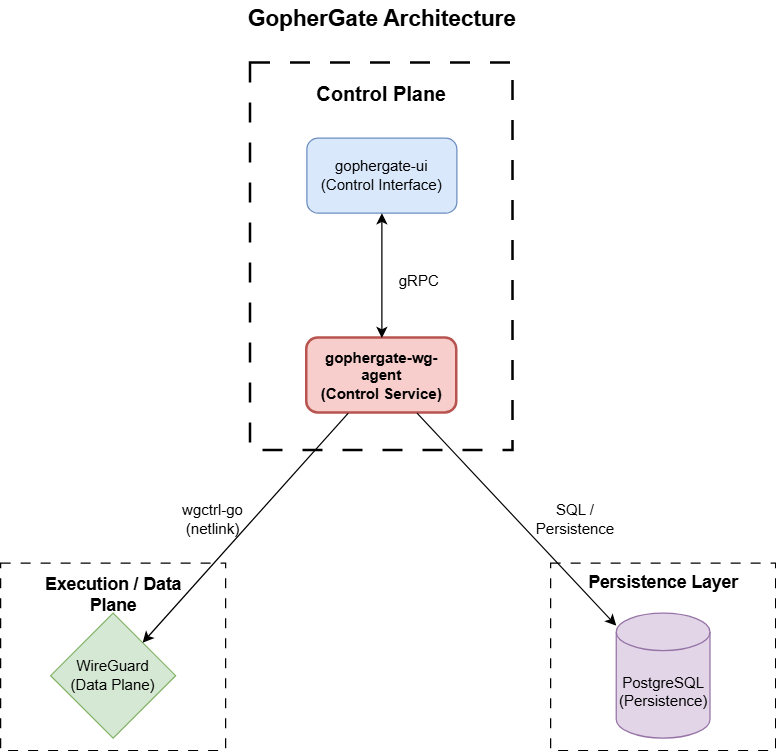

# GopherGate

GopherGate is a WireGuard management control plane built in Go.

It provides structured, automated peer lifecycle management through a clean separation between:

- UI (Control Interface)
- Agent (WireGuard Controller)
- PostgreSQL (Persistence Layer)
- WireGuard (Network Layer)

Instead of editing WireGuard configs manually, GopherGate introduces a backend service layer with persistence and API access.

## Architecture Overview

GopherGate follows a gRPC-based control architecture.


## Component Responsibilities

### gophergate-wg-agent

- Manages WireGuard peers
- Hosts the gRPC server
- Persists peer metadata to PostgreSQL
- Talks to kernel using `wgctrl-go`
- Only component allowed to modify WireGuard state

Modes:

- CLI mode
- gRPC server mode (`serve`)

### gophergate-ui

- Connects to agent via gRPC
- Provides management interface
- Displays peer status
- Does not modify WireGuard directly

### PostgreSQL

Stores:

- Peer metadata
- Key references
- Future audit logs

## Development Environment

Located under:

```code
/dev-sim
```

This provides:

- WireGuard (host network mode)
- PostgreSQL
- Local simulation stack

### Start

```bash
cd dev-sim
docker-compose -f dev-sim.yaml up -d
```

### Run agent

```bash
sudo go run ./cmd/gophergate-wg-agent serve
```

### Run UI

```bash
sudo go run ./cmd/gophergate-ui
```

## Production Deployment

Production deployments should use the official Helm chart repository.

### Helm Chart (Official Deployment Method)

The production deployment for GopherGate is maintained in a separate repository:

**Helm Chart Repository:** [gophergate](https://github.com/Cyrof/CyroStack/tree/main/gophergate-deploy/gophergate)

The Helm chart deploys:

- gophergate-wg-agent
- gophergate-ui
- PostgreSQL
- Required services
- Proper host networking / security context

The Helm chart is the recommended and supported way to deploy GopherGate in:

- Kubernetes
- k3s
- On-prem clusters

## Docker Image

Both the Agent and UI images are published under a single Docker repository [cyrof/gophergate](https://hub.docker.com/repository/docker/cyrof/gophergate/general). They are differentiated by tags.

### Agent Image

```code
cyrof/gophergate:gophergate-wg-agent-latest
cyrof/gophergate:gophergate-wg-agent-<version>
```

#### Behavior

- Automatically runs in `serve` mode
- Hosts the gRPC server
- Manages WireGuard peers
- Persists to PostgreSQL

#### Requirements

- `CAP_NET_ADMIN`
- WireGuard kernel module available on host
- Host networking recommended
- PostgreSQL accessible

Example run (standalone test only):

```bash
docker run -d \
    --name gophergate-agent \
    --network host \
    --cap-add NET_ADMIN \
    -e DATABASE_URL=postgres://... \
    cyrof/gophergate:gophergate-wg-agent-latest
```

### UI Image

```code
cyrof/gophergate:gophergate-ui-latest
cyrof/gophergate:gophergate-ui-<version>
```

#### Behavior

- Connects to the Agent via gRPC
- Provides management interface
- Does not directly access WireGuard

Example run:

```bash
docker run -d \
    --name gophergate-ui \
    -p 3000:3000 \
    -e AGENT_GRPC_ADDR=<agent-host>:<port> \
    cyrof/gophergate:gophergate-ui-latest
```

## Repository Structure

```code
GopherGate/
├── assets
├── dev-sim
├── docs
├── gophergate-core
├── gophergate-ui
├── gophergate-wg-agent
├── LICENSE
└── README.md
```

## Phase Status

### Phase 1 &mdash; Core Control Plane (Completed)

- Peer CRUD
- PostgreSQL persistence
- gRPC server
- CLI interface
- Development simulation environment

### Phase 2 &mdash; QoL + UI Improvements (In Progress)

- Auto key generation
- Config export
- QR code generation
- UI polish
- Bug fixes

## Design Principles

- Clear separation of control and execution
- Agent is sole authority over through gRPC
- UI communicates only through gRPC
- Database-backed persistence
- Kubernetes-ready deployment model

## Security (Current)

- Agent requires root or `CAP_NET_ADMIN`
- gRPC currently assumes trusted network
- Authentication & RBAC planned
- TLS support planned for gRPC

## Roadmap

- RBAC
- TLS-secured gRPC
- Observability (Prometheus)
- Audit logging
- HA agent model
- Multi-node support
